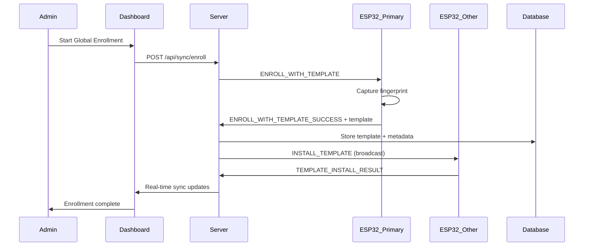

# Global Fingerprint Template Synchronization System

## Overview

The new **Global Template Sync System** solves the major usability issue where users had to enroll their fingerprint on every single scanner. Now users enroll **once** and their fingerprint template is automatically synchronized to **all active devices** in the system.

## Key Benefits

✅ **Enroll Once, Access Everywhere** - Users only need to enroll their fingerprint on one scanner
✅ **Automatic Synchronization** - Template is distributed to all active devices automatically
✅ **Future-Proof** - New devices automatically receive all existing user templates
✅ **Centralized Management** - All templates stored securely in the database
✅ **Real-Time Monitoring** - Live sync status and health monitoring
✅ **Backward Compatible** - Works alongside existing enrollment system

---

## How It Works

### 1. **Database Changes**

Enhanced User model with centralized template storage:

```javascript
// New fields in User model
{
  // Global fingerprint ID (unique across entire system)
  globalFingerprintId: 123,
  
  // Base64-encoded fingerprint template data
  fingerprintTemplate: "base64_template_data...",
  
  // Template metadata
  templateMetadata: {
    quality: 95,
    templateSize: 512,
    enrollmentDevice: "68:FE:71:F8:31:A0",
    templateFormat: "R308",
    createdAt: "2024-02-15T10:30:00Z"
  },
  
  // Device synchronization tracking
  syncedDevices: [
    {
      deviceMAC: "68:FE:71:F8:31:A0",
      scannerID: "SCANNER-ENTRANCE-A",
      localFingerprintId: 1,
      clusterID: "ENTRANCE_A",
      syncStatus: "synced",
      syncedAt: "2024-02-15T10:32:15Z"
    },
    // ... more devices
  ]
}
```

### 2. **Template Sync Service**

New service handles all template synchronization:

- **Template Storage**: Stores fingerprint templates in database
- **Automatic Distribution**: Sends templates to all active devices
- **Sync Tracking**: Monitors synchronization status per device
- **Retry Logic**: Handles failed synchronizations automatically
- **ID Management**: Manages global and local fingerprint IDs

### 3. **Enhanced MQTT Commands**

New MQTT commands for template management:

```json
// Primary enrollment with template capture
{
  "action": "ENROLL_WITH_TEMPLATE",
  "globalFingerprintId": 123,
  "userId": "user123",
  "targetDeviceMAC": "68:FE:71:F8:31:A0",
  "requestTemplate": true
}

// Template installation on other devices
{
  "action": "INSTALL_TEMPLATE",
  "globalFingerprintId": 123,
  "localFingerprintId": 5,
  "templateData": "base64_template...",
  "targetDeviceMAC": "68:FE:71:F8:31:B1"
}

// Template removal
{
  "action": "DELETE_TEMPLATE", 
  "globalFingerprintId": 123,
  "localFingerprintId": 5,
  "targetDeviceMAC": "68:FE:71:F8:31:B1"
}
```

---

## API Endpoints

### Global Enrollment
```
POST /api/sync/enroll
{
  "userId": "user123",
  "deviceMAC": "68:FE:71:F8:31:A0", 
  "scannerID": "SCANNER-ENTRANCE-A"
}
```

### Sync Status Monitoring
```
GET /api/sync/status/:userId
GET /api/sync/overview
```

### Sync Management
```
POST /api/sync/retry/:userId
POST /api/sync/sync-device/:deviceMAC
DELETE /api/sync/user/:userId
```

---

## Dashboard Components

### 1. **GlobalEnrollmentModal**

Enhanced enrollment modal with two modes:

- **Global Mode** (Recommended): Enroll once, sync to all devices
- **Single Scanner Mode**: Legacy mode for specific use cases

**Features:**
- Mode selection interface
- Real-time enrollment progress
- Template synchronization progress
- Device sync status monitoring

### 2. **TemplateSyncDashboard** 

Comprehensive sync monitoring dashboard:

- System-wide sync health metrics
- Per-user sync status
- Failed sync retry functionality
- Real-time sync event monitoring

---

## Enrollment Flow

### Global Enrollment Process

1. **Initiate Enrollment**
   - Admin selects "Global Enrollment" mode
   - Chooses any active scanner
   - System generates Global Fingerprint ID

2. **Primary Device Enrollment**
   - User places finger on selected scanner
   - Device captures fingerprint template
   - Template data sent to server via RabbitMQ

3. **Template Storage**
   - Server stores template in database
   - Creates sync records for all devices
   - Emits enrollment success event

4. **Automatic Synchronization**
   - Template sent to all other active devices
   - Each device installs template with local ID
   - Sync status tracked per device

5. **Real-Time Updates**
   - Dashboard shows sync progress
   - Notifications for sync successes/failures
   - Final confirmation when all devices synced

### Message Flow



---

## ESP32 Implementation Requirements

### New Commands to Handle

```cpp
void handleMQTTCommand(JsonDocument& doc) {
  const char* action = doc["action"];
  
  if (strcmp(action, "ENROLL_WITH_TEMPLATE") == 0) {
    // Standard enrollment but capture template data
    startEnrollmentWithTemplateCapture(doc);
    
  } else if (strcmp(action, "INSTALL_TEMPLATE") == 0) {
    // Install pre-captured template
    installFingerprintTemplate(doc);
    
  } else if (strcmp(action, "DELETE_TEMPLATE") == 0) {
    // Remove fingerprint template
    deleteFingerprintTemplate(doc);
  }
}
```

### Template Capture Example

```cpp
void onEnrollmentComplete(int localId, bool success) {
  if (success) {
    // Capture template data for global sync
    uint8_t templateBuffer[512];
    uint16_t templateSize = finger.downloadModel(templateBuffer);
    
    // Send success with template data
    StaticJsonDocument<2048> response;
    response["eventType"] = "ENROLL_WITH_TEMPLATE_SUCCESS";
    response["deviceMAC"] = WiFi.macAddress();
    response["payload"]["userId"] = currentUserId;
    response["payload"]["globalFingerprintId"] = globalFpId;
    response["payload"]["templateData"] = base64_encode(templateBuffer, templateSize);
    response["payload"]["templateMetadata"]["quality"] = fingerQuality;
    response["payload"]["templateMetadata"]["size"] = templateSize;
    
    publishToRabbitMQ(response);
  }
}
```

---

## Configuration

### Environment Variables
```env
# Template sync settings
TEMPLATE_SYNC_TIMEOUT=30000
TEMPLATE_MAX_RETRY=3
TEMPLATE_BATCH_SIZE=5

# Storage settings  
TEMPLATE_STORAGE_ENCRYPTION=true
TEMPLATE_COMPRESSION=true
```

### System Settings
- **Auto-sync new devices**: Automatically sync all user templates to newly approved devices
- **Retry failed syncs**: Automatically retry failed synchronizations
- **Template compression**: Compress template data for storage efficiency
- **Sync timeout**: Maximum time to wait for sync confirmation

---

## Monitoring & Troubleshooting

### Sync Health Monitoring

The system provides comprehensive monitoring:

- **Real-time sync status** per user per device
- **System-wide sync health percentage**
- **Failed sync identification and retry**
- **Device connectivity monitoring**

### Common Issues & Solutions

1. **Template Sync Failures**
   - Check device connectivity
   - Verify device storage capacity
   - Use retry functionality

2. **Template Quality Issues**
   - Ensure good fingerprint enrollment quality
   - Re-enroll with better finger placement
   - Check sensor cleanliness

3. **Storage Considerations**
   - Monitor template storage size
   - Implement template cleanup for deleted users
   - Consider template compression

---

## Security Considerations

### Template Protection
- Templates stored as Base64 encoded data
- Optional encryption at rest
- Secure MQTT transmission
- Access control on template APIs

### Privacy Compliance
- Templates are biometric data - handle per local laws
- User consent for template storage
- Data retention policies
- Audit logging for template access

---

## Migration from Legacy System

### Backward Compatibility
- Existing enrollments continue to work
- Legacy API endpoints remain functional
- Gradual migration path available

### Migration Strategy
1. Deploy new system alongside legacy
2. New enrollments use global sync
3. Optionally migrate existing users
4. Phase out single-scanner enrollments

---

## Performance Considerations

### Template Sync Performance
- **Parallel sync**: Templates sent to multiple devices simultaneously
- **Batching**: Process multiple templates in batches
- **Compression**: Reduce template data size
- **Caching**: Cache templates for faster distribution

### Storage Optimization
- **Template deduplication**: Avoid storing identical templates
- **Data compression**: Compress template data
- **Cleanup policies**: Remove orphaned template data

---

## Future Enhancements

### Planned Features
- **Template versioning**: Track template updates over time
- **Sync scheduling**: Batch sync operations during off-hours
- **Template analytics**: Usage patterns and quality metrics
- **Multi-tenant support**: Isolated templates per organization

### Advanced Features
- **Template clustering**: Group similar templates for optimization
- **Predictive sync**: Pre-sync templates to likely devices
- **Template backup**: Automated template backup and recovery
- **Cross-system sync**: Sync templates across multiple installations

---

This new system transforms the enrollment experience from "enroll everywhere" to "enroll once, access everywhere" while maintaining security, performance, and reliability of the biometric system.