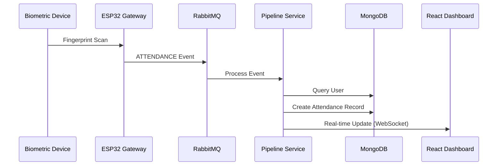
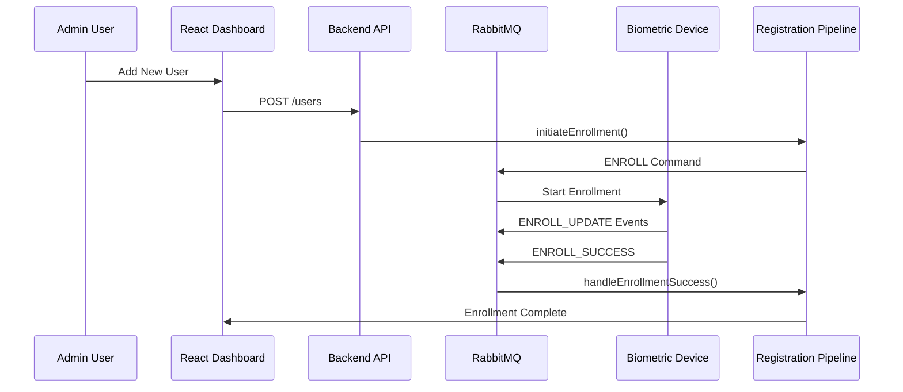
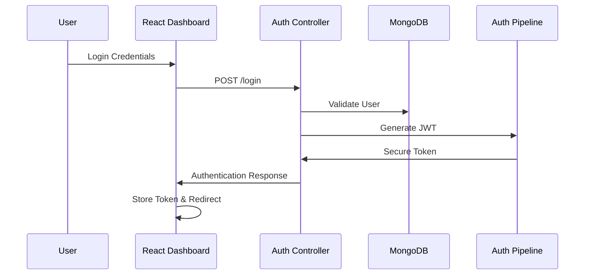

# IoT Biometric Attendance System - Pipeline Architecture

## Overview
This document outlines the complete data flow and service pipeline architecture for the IoT Biometric Attendance System. The system processes biometric data through multiple interconnected pipelines for user registration, authentication, and attendance tracking.

## System Architecture Diagram
```
┌─────────────────┐    ┌──────────────┐    ┌─────────────────┐
│   Biometric     │    │   ESP32      │    │   RabbitMQ      │
│   Devices       │◄──►│   Gateway    │◄──►│   Message       │
│   (Scanners)    │    │              │    │   Queue         │
└─────────────────┘    └──────────────┘    └─────────────────┘
                                                     │
                                                     ▼
┌─────────────────────────────────────────────────────────────────┐
│                    Backend Services                             │
│  ┌─────────────┐  ┌─────────────┐  ┌─────────────┐            │
│  │Registration │  │Recognition  │  │  Analytics  │            │
│  │  Pipeline   │  │  Pipeline   │  │  Pipeline   │            │
│  └─────────────┘  └─────────────┘  └─────────────┘            │
└─────────────────────────────────────────────────────────────────┘
                              │
                              ▼
┌─────────────────────────────────────────────────────────────────┐
│                     Data Layer                                  │
│  ┌─────────────┐  ┌─────────────┐  ┌─────────────┐            │
│  │   MongoDB   │  │   User      │  │ Attendance  │            │
│  │  Database   │  │  Storage    │  │   Logs      │            │
│  └─────────────┘  └─────────────┘  └─────────────┘            │
└─────────────────────────────────────────────────────────────────┘
                              │
                              ▼
┌─────────────────────────────────────────────────────────────────┐
│                  Frontend Dashboard                             │
│  ┌─────────────┐  ┌─────────────┐  ┌─────────────┐            │
│  │    React    │  │   Real-time │  │   Reports   │            │
│  │     UI      │  │   Updates   │  │ & Analytics │            │
│  └─────────────┘  └─────────────┘  └─────────────┘            │
└─────────────────────────────────────────────────────────────────┘
```

## Core Pipeline Components

### 1. Message Queue Infrastructure
**Technology**: RabbitMQ  
**Location**: `server/services/rabbitmq/rabbitMQService.js`

#### Queues:
- **biometric_events**: Incoming events from devices
- **biometric_commands**: Outgoing commands to devices

#### Message Types:
- `ATTENDANCE`: Fingerprint recognition events
- `ENROLL_SUCCESS`: Successful biometric registration
- `ENROLL_UPDATE`: Registration progress updates
- `ENROLL_FAILED`: Failed registration attempts

### 2. Registration Pipeline
**Location**: `server/services/pipelines/registrationService.js`

#### Process Flow:
```
1. User Initiates Registration
   ↓
2. Assign Fingerprint ID
   ↓
3. Send ENROLL Command to Device
   ↓
4. Device Captures Biometric Data
   ↓
5. Process Success/Failure Response
   ↓
6. Update User Record in Database
```

#### Key Functions:
- `initiateEnrollment(userId, deviceId)`: Starts the enrollment process
- `handleEnrollmentSuccess(payload)`: Processes successful registrations
- ID Assignment Logic: Auto-incrementing fingerprint IDs

### 3. Recognition Pipeline
**Location**: `server/services/pipelines/recognitionService.js`

#### Process Flow:
```
1. Device Scans Fingerprint
   ↓
2. Send ATTENDANCE Event via RabbitMQ
   ↓
3. Lookup User by Fingerprint ID
   ↓
4. Apply Business Rules (Time, Shifts)
   ↓
5. Create Attendance Record
   ↓
6. Trigger Real-time Updates
   ↓
7. Process Analytics Data
```

#### Business Logic:
- **Shift Management**: Configurable start times
- **Late Detection**: Threshold-based late marking
- **Duplicate Prevention**: Same-session attendance filtering
- **Audit Trail**: Complete event logging

### 4. Authentication Pipeline
**Location**: `server/controllers/auth/authController.js`

#### Process Flow:
```
1. User Login Request
   ↓
2. Validate Credentials
   ↓
3. Generate JWT Token
   ↓
4. Log Authentication Event
   ↓
5. Return Secure Session
```

#### Security Features:
- JWT Token Management
- Password Hashing (bcrypt)
- Session Logging with IP/User-Agent
- Secure Cookie Handling

## Service Layer Architecture

### Core Services Directory Structure:
```
server/services/
├── analytics-ml/          # ML-based attendance analytics
├── auth/                  # Authentication services
├── notification/          # Alert and notification system
├── occupancy-state/       # Real-time occupancy tracking
├── pipelines/             # Core processing pipelines
│   ├── recognitionService.js
│   └── registrationService.js
├── policy-config/         # System configuration management
├── rabbitmq/              # Message queue handling
└── sync-manager/          # Data synchronization services
```

### Planned Service Implementations:

#### Analytics Pipeline (`analytics-ml/`)
- **Purpose**: Machine learning-based attendance pattern analysis
- **Features**: Anomaly detection, predictive analytics, behavior patterns
- **Data Sources**: Historical attendance, user patterns, device metrics

#### Notification Pipeline (`notification/`)
- **Purpose**: Real-time alerts and communications
- **Features**: Email/SMS notifications, admin alerts, attendance reminders
- **Triggers**: Late arrivals, absent users, system errors

#### Occupancy State Pipeline (`occupancy-state/`)
- **Purpose**: Real-time room/facility occupancy tracking
- **Features**: Live headcount, capacity management, safety compliance
- **Data Flow**: Entry/exit events → occupancy calculation → dashboard updates

#### Policy Configuration Pipeline (`policy-config/`)
- **Purpose**: Dynamic system rule management
- **Features**: Shift schedules, late policies, access permissions
- **Configuration**: Database-driven rules, hot-reload capabilities

#### Sync Manager Pipeline (`sync-manager/`)
- **Purpose**: Multi-device and cross-system synchronization
- **Features**: Device firmware updates, data backup, conflict resolution
- **Coordination**: Device registry, heartbeat monitoring, failover handling

## Data Flow Patterns

### 1. Real-time Event Processing


### 2. User Registration Flow


### 3. Authentication & Authorization Flow


## Configuration and Environment

### Environment Variables:
```env
# Message Queue
RABBITMQ_URI=amqp://localhost

# Database
MONGODB_URI=mongodb://localhost:27017/IOT_Biometrics

# Authentication
JWT_SECRET=your_secure_secret_key

# Services
PORT=5000
NODE_ENV=development
```

### System Settings (Database-Driven):
- `SHIFT_START_TIME`: Default work/class start time
- `CLASS_END_TIME`: End time for sessions
- `LATE_THRESHOLD`: Minutes before marking as late
- `DUPLICATE_WINDOW`: Time window for duplicate detection

## Error Handling and Recovery

### Pipeline Resilience:
1. **Message Queue Failures**: Automatic reconnection with exponential backoff
2. **Database Connectivity**: Graceful degradation and retry logic
3. **Device Communication**: Timeout handling and status monitoring
4. **Authentication Issues**: Secure error logging and user feedback

### Monitoring and Logging:
- **Request/Response Logging**: All API calls with timestamps
- **Authentication Events**: Login attempts with IP tracking
- **Pipeline Events**: Detailed processing logs for debugging
- **Error Tracking**: Comprehensive error capture and alerting

## Performance Considerations

### Scalability Features:
- **Message Queue Persistence**: Durable queues for reliability
- **Database Indexing**: Optimized queries for user lookup
- **Real-time Updates**: Efficient WebSocket connections
- **Caching Strategy**: Session management and frequent data

### Future Enhancements:
- **Load Balancing**: Multiple service instances
- **Database Sharding**: User and attendance data partitioning
- **Analytics Caching**: Pre-computed reports and metrics
- **Device Management**: Automated firmware updates and monitoring

## API Integration Points

### External Interfaces:
- **Frontend Dashboard**: REST API + WebSocket for real-time updates
- **Biometric Devices**: RabbitMQ message protocol
- **Mobile Apps**: RESTful API with JWT authentication
- **Third-party Systems**: Webhook notifications and data exports

### Internal Service Communication:
- **Inter-service Messaging**: RabbitMQ event-driven architecture
- **Database Access**: Mongoose ODM with connection pooling
- **Configuration Management**: Centralized settings service
- **Logging and Monitoring**: Structured logging with correlation IDs

This pipeline architecture provides a robust, scalable foundation for the IoT Biometric Attendance System, ensuring reliable data processing, real-time capabilities, and comprehensive monitoring across all system components.