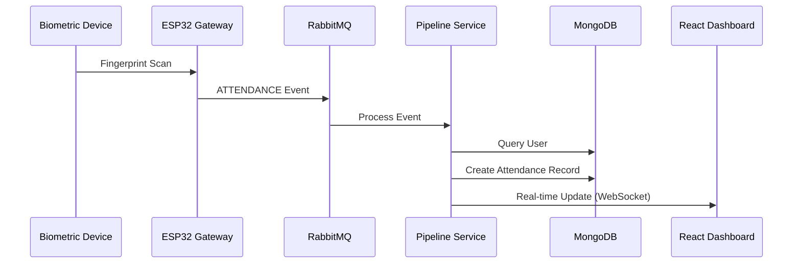
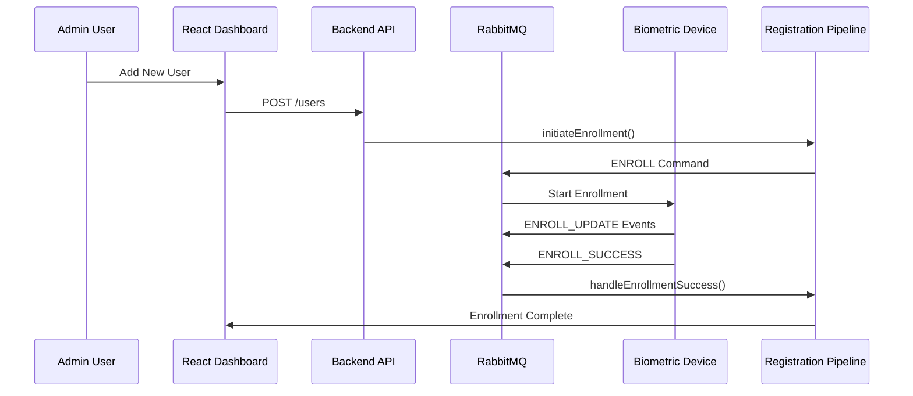
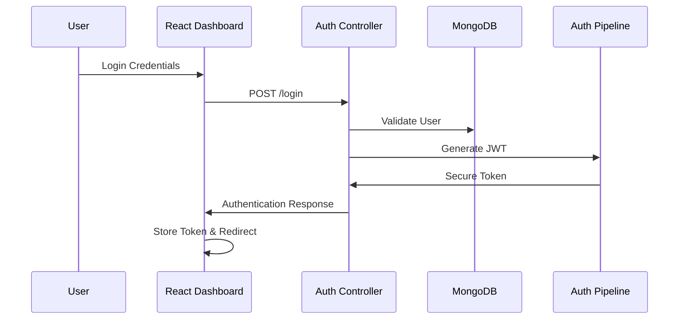
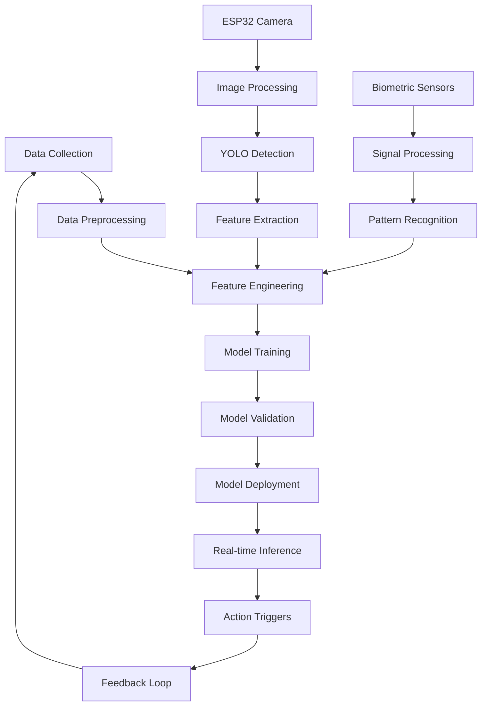
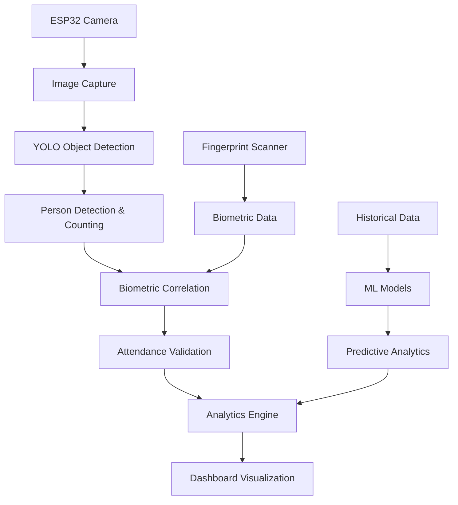

# IoT Biometric Attendance System - Pipeline Architecture

## Overview
This document outlines the complete data flow and service pipeline architecture for the IoT Biometric Attendance System. The system processes biometric data through multiple interconnected pipelines for user registration, authentication, and attendance tracking.

## System Architecture Diagram
```
┌─────────────────┐    ┌──────────────┐    ┌─────────────────┐
│   Biometric     │    │   ESP32      │    │   RabbitMQ      │
│   Devices       │◄──►│   Gateway    │◄──►│   Message       │
│   (Scanners)    │    │              │    │   Queue         │
└─────────────────┘    └──────────────┘    └─────────────────┘
                                                     │
                                                     ▼
┌─────────────────────────────────────────────────────────────────┐
│                    Backend Services                             │
│  ┌─────────────┐  ┌─────────────┐  ┌─────────────┐            │
│  │Registration │  │Recognition  │  │  Analytics  │            │
│  │  Pipeline   │  │  Pipeline   │  │  Pipeline   │            │
│  └─────────────┘  └─────────────┘  └─────────────┘            │
└─────────────────────────────────────────────────────────────────┘
                              │
                              ▼
┌─────────────────────────────────────────────────────────────────┐
│                     Data Layer                                  │
│  ┌─────────────┐  ┌─────────────┐  ┌─────────────┐            │
│  │   MongoDB   │  │   User      │  │ Attendance  │            │
│  │  Database   │  │  Storage    │  │   Logs      │            │
│  └─────────────┘  └─────────────┘  └─────────────┘            │
└─────────────────────────────────────────────────────────────────┘
                              │
                              ▼
┌─────────────────────────────────────────────────────────────────┐
│                  Frontend Dashboard                             │
│  ┌─────────────┐  ┌─────────────┐  ┌─────────────┐            │
│  │    React    │  │   Real-time │  │   Reports   │            │
│  │     UI      │  │   Updates   │  │ & Analytics │            │
│  └─────────────┘  └─────────────┘  └─────────────┘            │
└─────────────────────────────────────────────────────────────────┘
```

## Core Pipeline Components

### 1. Message Queue Infrastructure
**Technology**: RabbitMQ  
**Location**: `server/services/rabbitmq/rabbitMQService.js`

#### Queues:
- **biometric_events**: Incoming events from devices
- **biometric_commands**: Outgoing commands to devices

#### Message Types:
- `ATTENDANCE`: Fingerprint recognition events
- `ENROLL_SUCCESS`: Successful biometric registration
- `ENROLL_UPDATE`: Registration progress updates
- `ENROLL_FAILED`: Failed registration attempts

### 2. Registration Pipeline
**Location**: `server/services/pipelines/registrationService.js`

#### Process Flow:
```
1. User Initiates Registration
   ↓
2. Assign Fingerprint ID
   ↓
3. Send ENROLL Command to Device
   ↓
4. Device Captures Biometric Data
   ↓
5. Process Success/Failure Response
   ↓
6. Update User Record in Database
```

#### Key Functions:
- `initiateEnrollment(userId, deviceId)`: Starts the enrollment process
- `handleEnrollmentSuccess(payload)`: Processes successful registrations
- ID Assignment Logic: Auto-incrementing fingerprint IDs

### 3. Recognition Pipeline
**Location**: `server/services/pipelines/recognitionService.js`

#### Process Flow:
```
1. Device Scans Fingerprint
   ↓
2. Send ATTENDANCE Event via RabbitMQ
   ↓
3. Lookup User by Fingerprint ID
   ↓
4. Apply Business Rules (Time, Shifts)
   ↓
5. Create Attendance Record
   ↓
6. Trigger Real-time Updates
   ↓
7. Process Analytics Data
```

#### Business Logic:
- **Shift Management**: Configurable start times
- **Late Detection**: Threshold-based late marking
- **Duplicate Prevention**: Same-session attendance filtering
- **Audit Trail**: Complete event logging

### 4. Authentication Pipeline
**Location**: `server/controllers/auth/authController.js`

#### Process Flow:
```
1. User Login Request
   ↓
2. Validate Credentials
   ↓
3. Generate JWT Token
   ↓
4. Log Authentication Event
   ↓
5. Return Secure Session
```

#### Security Features:
- JWT Token Management
- Password Hashing (bcrypt)
- Session Logging with IP/User-Agent
- Secure Cookie Handling

## Service Layer Architecture

### Core Services Directory Structure:
```
server/services/
├── analytics-ml/          # ML-based attendance analytics
├── auth/                  # Authentication services
├── notification/          # Alert and notification system
├── occupancy-state/       # Real-time occupancy tracking
├── pipelines/             # Core processing pipelines
│   ├── recognitionService.js
│   └── registrationService.js
├── policy-config/         # System configuration management
├── rabbitmq/              # Message queue handling
└── sync-manager/          # Data synchronization services
```

### Planned Service Implementations:

#### Analytics Pipeline (`analytics-ml/`)
- **Purpose**: Machine learning-based attendance pattern analysis and computer vision processing
- **Features**: Anomaly detection, predictive analytics, behavior patterns, image analysis with YOLO
- **Data Sources**: Historical attendance, user patterns, device metrics, ESP32 camera feeds
- **ML Models**: YOLO object detection, time-series forecasting, clustering algorithms

#### Notification Pipeline (`notification/`)
- **Purpose**: Real-time alerts and communications
- **Features**: Email/SMS notifications, admin alerts, attendance reminders
- **Triggers**: Late arrivals, absent users, system errors

#### Occupancy State Pipeline (`occupancy-state/`)
- **Purpose**: Real-time room/facility occupancy tracking
- **Features**: Live headcount, capacity management, safety compliance
- **Data Flow**: Entry/exit events → occupancy calculation → dashboard updates

#### Policy Configuration Pipeline (`policy-config/`)
- **Purpose**: Dynamic system rule management
- **Features**: Shift schedules, late policies, access permissions
- **Configuration**: Database-driven rules, hot-reload capabilities

#### Sync Manager Pipeline (`sync-manager/`)
- **Purpose**: Multi-device and cross-system synchronization
- **Features**: Device firmware updates, data backup, conflict resolution
- **Coordination**: Device registry, heartbeat monitoring, failover handling

## Data Flow Patterns

### 1. Real-time Event Processing


### 2. User Registration Flow


### 3. Authentication & Authorization Flow


## Configuration and Environment

### Environment Variables:
```env
# Message Queue
RABBITMQ_URI=amqp://localhost

# Database
MONGODB_URI=mongodb://localhost:27017/IOT_Biometrics

# Authentication
JWT_SECRET=your_secure_secret_key

# Services
PORT=5000
NODE_ENV=development
```

### System Settings (Database-Driven):
- `SHIFT_START_TIME`: Default work/class start time
- `CLASS_END_TIME`: End time for sessions
- `LATE_THRESHOLD`: Minutes before marking as late
- `DUPLICATE_WINDOW`: Time window for duplicate detection

## Error Handling and Recovery

### Pipeline Resilience:
1. **Message Queue Failures**: Automatic reconnection with exponential backoff
2. **Database Connectivity**: Graceful degradation and retry logic
3. **Device Communication**: Timeout handling and status monitoring
4. **Authentication Issues**: Secure error logging and user feedback

### Monitoring and Logging:
- **Request/Response Logging**: All API calls with timestamps
- **Authentication Events**: Login attempts with IP tracking
- **Pipeline Events**: Detailed processing logs for debugging
- **Error Tracking**: Comprehensive error capture and alerting

## Performance Considerations

### Scalability Features:
- **Message Queue Persistence**: Durable queues for reliability
- **Database Indexing**: Optimized queries for user lookup
- **Real-time Updates**: Efficient WebSocket connections
- **Caching Strategy**: Session management and frequent data

### Future Enhancements:
- **Load Balancing**: Multiple service instances
- **Database Sharding**: User and attendance data partitioning
- **Analytics Caching**: Pre-computed reports and metrics
- **Device Management**: Automated firmware updates and monitoring

## API Integration Points

### External Interfaces:
- **Frontend Dashboard**: REST API + WebSocket for real-time updates
- **Biometric Devices**: RabbitMQ message protocol
- **Mobile Apps**: RESTful API with JWT authentication
- **Third-party Systems**: Webhook notifications and data exports

### Internal Service Communication:
- **Inter-service Messaging**: RabbitMQ event-driven architecture
- **Database Access**: Mongoose ODM with connection pooling
- **Configuration Management**: Centralized settings service
- **Logging and Monitoring**: Structured logging with correlation IDs

This pipeline architecture provides a robust, scalable foundation for the IoT Biometric Attendance System, ensuring reliable data processing, real-time capabilities, and comprehensive monitoring across all system components.

## 1️⃣ Data Analysis Pipeline - Advanced Analytics & Computer Vision

### Overview
The Data Analysis Pipeline forms the intelligent core of the IoT Biometric Attendance System, combining traditional attendance analytics with advanced computer vision capabilities through ESP32 camera integration and YOLO-based object detection.

## 2️⃣ AI/ML Pipeline - Machine Learning Workflow

### AI/ML Architecture Overview
```
Raw Data → Preprocessing → Feature Engineering → Model Training → Inference → Action
```

**ML Pipeline Components:**


### Machine Learning Models Implementation

#### 1. Computer Vision Models
**YOLO Object Detection Pipeline:**
```python
import torch
from ultralytics import YOLO
import cv2
import numpy as np

class ComputerVisionPipeline:
    def __init__(self):
        # Load pre-trained YOLO model
        self.yolo_model = YOLO('yolov8n.pt')
        self.person_tracker = {}
        self.confidence_threshold = 0.5
        
    def process_camera_feed(self, frame):
        """Process single frame from ESP32 camera"""
        # Preprocessing
        processed_frame = self.preprocess_image(frame)
        
        # YOLO inference
        results = self.yolo_model(processed_frame)
        
        # Extract person detections
        persons = self.extract_persons(results)
        
        # Track persons across frames
        tracked_persons = self.track_persons(persons)
        
        return tracked_persons
    
    def preprocess_image(self, image):
        """Image preprocessing for better detection"""
        # Resize to standard size
        resized = cv2.resize(image, (640, 640))
        
        # Normalize pixel values
        normalized = resized / 255.0
        
        # Apply noise reduction
        denoised = cv2.bilateralFilter(normalized, 9, 75, 75)
        
        return denoised
    
    def extract_persons(self, results):
        """Extract person detections from YOLO results"""
        persons = []
        for result in results:
            boxes = result.boxes
            for box in boxes:
                if box.cls == 0 and box.conf > self.confidence_threshold:  # Person class
                    persons.append({
                        'bbox': box.xyxy[0].tolist(),
                        'confidence': box.conf.item(),
                        'timestamp': time.time()
                    })
        return persons
    
    def track_persons(self, detections):
        """Track persons across frames for counting"""
        # Implement object tracking logic
        # Update person tracker dictionary
        # Return tracked person IDs and positions
        pass
```

#### 2. Time Series Analysis Models
**Attendance Pattern Prediction:**
```python
import pandas as pd
from sklearn.preprocessing import StandardScaler
from tensorflow.keras.models import Sequential
from tensorflow.keras.layers import LSTM, Dense, Dropout

class AttendancePredictor:
    def __init__(self):
        self.model = None
        self.scaler = StandardScaler()
        self.sequence_length = 30  # 30 days of history
        
    def build_lstm_model(self, input_shape):
        """Build LSTM model for attendance prediction"""
        model = Sequential([
            LSTM(50, return_sequences=True, input_shape=input_shape),
            Dropout(0.2),
            LSTM(50, return_sequences=False),
            Dropout(0.2),
            Dense(25),
            Dense(1)
        ])
        
        model.compile(
            optimizer='adam',
            loss='mean_squared_error',
            metrics=['mae']
        )
        
        return model
    
    def prepare_training_data(self, attendance_data):
        """Prepare time series data for training"""
        # Convert to daily attendance counts
        daily_counts = attendance_data.groupby('date').size().reset_index()
        
        # Create sequences for LSTM
        X, y = [], []
        for i in range(self.sequence_length, len(daily_counts)):
            X.append(daily_counts.iloc[i-self.sequence_length:i]['count'])
            y.append(daily_counts.iloc[i]['count'])
        
        return np.array(X), np.array(y)
    
    def train_model(self, X, y):
        """Train the attendance prediction model"""
        # Scale the data
        X_scaled = self.scaler.fit_transform(X.reshape(-1, 1)).reshape(X.shape)
        
        # Build and train model
        self.model = self.build_lstm_model((X.shape[1], 1))
        
        # Train the model
        history = self.model.fit(
            X_scaled, y,
            epochs=100,
            batch_size=32,
            validation_split=0.2,
            verbose=1
        )
        
        return history
    
    def predict_attendance(self, recent_data):
        """Predict future attendance"""
        if self.model is None:
            raise ValueError("Model not trained yet")
        
        # Prepare input data
        X_pred = self.scaler.transform(recent_data.reshape(-1, 1)).reshape(1, -1, 1)
        
        # Make prediction
        prediction = self.model.predict(X_pred)
        
        return prediction[0][0]
```

#### 3. Anomaly Detection Models
**Multi-Model Anomaly Detection:**
```python
from sklearn.ensemble import IsolationForest
from sklearn.svm import OneClassSVM
from sklearn.preprocessing import StandardScaler
import numpy as np

class AnomalyDetectionPipeline:
    def __init__(self):
        self.models = {
            'isolation_forest': IsolationForest(contamination=0.1, random_state=42),
            'one_class_svm': OneClassSVM(nu=0.1, kernel='rbf', gamma='scale'),
            'lstm_autoencoder': None  # Will be initialized separately
        }
        self.scaler = StandardScaler()
        self.is_trained = False
        
    def extract_features(self, attendance_data):
        """Extract features for anomaly detection"""
        features = []
        
        for user_id in attendance_data['user_id'].unique():
            user_data = attendance_data[attendance_data['user_id'] == user_id]
            
            # Time-based features
            hourly_pattern = user_data.groupby(user_data['timestamp'].dt.hour).size()
            daily_pattern = user_data.groupby(user_data['timestamp'].dt.dayofweek).size()
            
            # Behavioral features
            avg_arrival_time = user_data['timestamp'].dt.hour.mean()
            attendance_frequency = len(user_data)
            late_arrivals = sum(user_data['is_late'])
            
            # Compile feature vector
            feature_vector = [
                avg_arrival_time,
                attendance_frequency,
                late_arrivals,
                hourly_pattern.std(),  # Consistency in timing
                daily_pattern.std()    # Weekly pattern consistency
            ]
            
            features.append(feature_vector)
        
        return np.array(features)
    
    def train_anomaly_models(self, training_data):
        """Train multiple anomaly detection models"""
        # Extract features
        features = self.extract_features(training_data)
        
        # Scale features
        features_scaled = self.scaler.fit_transform(features)
        
        # Train each model
        for name, model in self.models.items():
            if model is not None:
                print(f"Training {name}...")
                model.fit(features_scaled)
        
        self.is_trained = True
        print("Anomaly detection models trained successfully")
    
    def detect_anomalies(self, new_data):
        """Detect anomalies in new data"""
        if not self.is_trained:
            raise ValueError("Models not trained yet")
        
        # Extract features from new data
        features = self.extract_features(new_data)
        features_scaled = self.scaler.transform(features)
        
        # Get predictions from each model
        predictions = {}
        for name, model in self.models.items():
            if model is not None:
                pred = model.predict(features_scaled)
                predictions[name] = pred
        
        # Ensemble decision (majority voting)
        ensemble_pred = []
        for i in range(len(features)):
            votes = [pred[i] for pred in predictions.values()]
            # -1 indicates anomaly, 1 indicates normal
            ensemble_pred.append(-1 if votes.count(-1) > len(votes)/2 else 1)
        
        return ensemble_pred
```

#### 4. Behavioral Analysis Models
**User Behavior Pattern Recognition:**
```python
from sklearn.cluster import KMeans
from sklearn.preprocessing import StandardScaler
import pandas as pd

class BehaviorAnalysisPipeline:
    def __init__(self):
        self.kmeans = KMeans(n_clusters=5, random_state=42)
        self.scaler = StandardScaler()
        self.behavior_profiles = {}
        
    def create_user_profiles(self, attendance_data):
        """Create behavioral profiles for each user"""
        profiles = []
        user_ids = []
        
        for user_id in attendance_data['user_id'].unique():
            user_data = attendance_data[attendance_data['user_id'] == user_id]
            
            # Calculate behavioral metrics
            profile = {
                'punctuality_score': self.calculate_punctuality(user_data),
                'consistency_score': self.calculate_consistency(user_data),
                'frequency_score': self.calculate_frequency(user_data),
                'peak_time_preference': self.find_peak_time(user_data),
                'weekend_activity': self.calculate_weekend_activity(user_data)
            }
            
            profiles.append(list(profile.values()))
            user_ids.append(user_id)
        
        return np.array(profiles), user_ids
    
    def cluster_behaviors(self, attendance_data):
        """Cluster users based on behavior patterns"""
        profiles, user_ids = self.create_user_profiles(attendance_data)
        
        # Scale the features
        profiles_scaled = self.scaler.fit_transform(profiles)
        
        # Perform clustering
        clusters = self.kmeans.fit_predict(profiles_scaled)
        
        # Store behavior profiles
        for user_id, cluster in zip(user_ids, clusters):
            self.behavior_profiles[user_id] = {
                'cluster': cluster,
                'profile': profiles[user_ids.index(user_id)]
            }
        
        return clusters, user_ids
    
    def calculate_punctuality(self, user_data):
        """Calculate user punctuality score"""
        on_time = sum(~user_data['is_late'])
        total = len(user_data)
        return on_time / total if total > 0 else 0
    
    def calculate_consistency(self, user_data):
        """Calculate timing consistency"""
        if len(user_data) < 2:
            return 0
        
        arrival_times = user_data['timestamp'].dt.hour
        return 1 / (arrival_times.std() + 1)  # Higher score for more consistent times
    
    def predict_user_behavior(self, user_id, context):
        """Predict user behavior based on context"""
        if user_id not in self.behavior_profiles:
            return None
        
        profile = self.behavior_profiles[user_id]
        cluster = profile['cluster']
        
        # Use cluster characteristics to predict behavior
        prediction = {
            'expected_arrival_time': self.predict_arrival_time(cluster, context),
            'attendance_probability': self.predict_attendance_probability(cluster, context),
            'risk_level': self.assess_risk_level(cluster, context)
        }
        
        return prediction
```

### ML Model Deployment and Inference

#### Real-time Inference Pipeline
```python
class MLInferencePipeline:
    def __init__(self):
        self.vision_model = ComputerVisionPipeline()
        self.anomaly_detector = AnomalyDetectionPipeline()
        self.behavior_analyzer = BehaviorAnalysisPipeline()
        self.attendance_predictor = AttendancePredictor()
        
    async def process_real_time_data(self, camera_frame, biometric_data):
        """Process real-time data through all ML models"""
        results = {}
        
        # Computer vision processing
        if camera_frame is not None:
            persons_detected = self.vision_model.process_camera_feed(camera_frame)
            results['persons_detected'] = len(persons_detected)
            results['person_locations'] = persons_detected
        
        # Biometric correlation
        if biometric_data:
            user_id = biometric_data.get('user_id')
            
            # Anomaly detection
            anomaly_score = self.anomaly_detector.detect_anomalies(biometric_data)
            results['anomaly_detected'] = anomaly_score < 0
            
            # Behavior analysis
            behavior_prediction = self.behavior_analyzer.predict_user_behavior(
                user_id, {'time': datetime.now()}
            )
            results['behavior_prediction'] = behavior_prediction
        
        return results
    
    def trigger_actions(self, ml_results):
        """Trigger actions based on ML results"""
        actions = []
        
        # Security alerts
        if ml_results.get('anomaly_detected'):
            actions.append({
                'type': 'security_alert',
                'priority': 'high',
                'message': 'Anomalous behavior detected'
            })
        
        # Capacity management
        if ml_results.get('persons_detected', 0) > 50:
            actions.append({
                'type': 'capacity_alert',
                'priority': 'medium',
                'message': 'Room capacity approaching limit'
            })
        
        # Predictive alerts
        behavior = ml_results.get('behavior_prediction', {})
        if behavior.get('risk_level') == 'high':
            actions.append({
                'type': 'intervention_required',
                'priority': 'medium',
                'message': 'User requires attention'
            })
        
        return actions
```

### AI/ML Training and Continuous Learning

#### Model Training Pipeline
```python
class MLTrainingPipeline:
    def __init__(self):
        self.models = {}
        self.training_scheduler = None
        
    def setup_training_pipeline(self):
        """Setup automated training pipeline"""
        # Schedule weekly model retraining
        schedule.every().week.do(self.retrain_models)
        
        # Setup data validation
        self.setup_data_validation()
        
    def retrain_models(self):
        """Retrain all ML models with new data"""
        print("Starting model retraining...")
        
        # Fetch new training data
        new_data = self.fetch_training_data()
        
        # Validate data quality
        if self.validate_data_quality(new_data):
            # Retrain models
            self.train_all_models(new_data)
            
            # Validate model performance
            if self.validate_model_performance():
                self.deploy_updated_models()
                print("Models successfully updated and deployed")
            else:
                print("Model performance validation failed, keeping previous models")
        else:
            print("Data quality validation failed, skipping training")
    
    def continuous_learning(self, feedback_data):
        """Implement continuous learning from user feedback"""
        # Update model parameters based on feedback
        # Implement online learning algorithms
        # Adjust thresholds and parameters
        pass
```

This comprehensive AI/ML pipeline integrates seamlessly with the biometric attendance system, providing:

- **Real-time Computer Vision** with YOLO object detection
- **Predictive Analytics** using LSTM models
- **Anomaly Detection** with ensemble methods
- **Behavioral Analysis** through clustering and profiling
- **Continuous Learning** with automated retraining
- **Action Triggering** based on ML insights

### Architecture Components

#### Computer Vision Pipeline
```
ESP32 Camera Feed → Image Processing → YOLO Detection → Analytics Engine → Dashboard
```

**Technology Stack:**
- **Hardware**: ESP32-CAM modules for image capture
- **AI Framework**: YOLOv8 for real-time object detection
- **Processing**: OpenCV for image preprocessing
- **Storage**: MongoDB GridFS for image storage
- **Analytics**: Python scikit-learn, TensorFlow for ML models

#### Data Analysis Flow


### Core Analysis Capabilities

#### 1. Temporal Trends Analysis
**Purpose**: Identify patterns in attendance behavior over time

**Features:**
- **Daily Patterns**: Peak attendance hours, rush periods
- **Weekly Trends**: Day-of-week attendance variations
- **Monthly Analysis**: Seasonal attendance patterns
- **Yearly Overview**: Long-term trend identification

**Implementation:**
```python
# Temporal Analysis Pipeline
class TemporalAnalysis:
    def analyze_daily_patterns(self, attendance_data):
        # Hour-by-hour attendance distribution
        # Peak time identification
        # Rush period detection
        
    def weekly_trends(self, data):
        # Monday-to-Sunday analysis
        # Weekend vs weekday patterns
        # Weekly attendance rates
        
    def seasonal_analysis(self, historical_data):
        # Monthly attendance variations
        # Holiday impact analysis
        # Academic calendar correlation
```

**Dashboard Visualization:**
- Heat maps showing attendance density by time
- Line charts for trend visualization
- Comparative analysis charts (week-over-week, month-over-month)

#### 2. Threshold-Based Alerts System
**Purpose**: Proactive monitoring and automated alerting

**Alert Categories:**
- **Late Arrival Alerts**: Configurable late threshold exceeded
- **Absence Notifications**: Extended absence detection
- **Capacity Alerts**: Room occupancy limits
- **System Health**: Device malfunction detection
- **Security Alerts**: Unauthorized access attempts

**Implementation:**
```python
class ThresholdAlertSystem:
    def __init__(self):
        self.thresholds = {
            'late_threshold': 15,  # minutes
            'absence_threshold': 3,  # days
            'capacity_limit': 50,  # persons
            'device_offline': 5  # minutes
        }
    
    def check_late_arrivals(self, real_time_data):
        # Compare arrival time with shift start
        # Trigger notifications for late arrivals
        
    def monitor_absences(self, attendance_history):
        # Track consecutive absent days
        # Generate absence alerts
        
    def capacity_monitoring(self, occupancy_count):
        # Real-time occupancy vs capacity
        # Overflow warnings
```

**Alert Delivery:**
- Real-time dashboard notifications
- Email/SMS alerts to administrators
- Mobile app push notifications
- Webhook integrations for third-party systems

#### 3. Sensor Data Correlation
**Purpose**: Cross-reference multiple data sources for enhanced accuracy

**Correlation Types:**
- **Biometric + Camera**: Verify fingerprint with visual confirmation
- **Entry/Exit Correlation**: Match entry and exit events
- **Time Correlation**: Cross-validate timestamps across devices
- **Location Correlation**: Multi-room attendance tracking

**Implementation:**
```python
class SensorCorrelation:
    def biometric_camera_correlation(self, fingerprint_data, camera_detection):
        # Match fingerprint scan with person detection
        # Validate identity through multiple sensors
        
    def entry_exit_matching(self, entry_events, exit_events):
        # Pair entry and exit for accurate duration
        # Detect incomplete sessions
        
    def multi_device_validation(self, device_readings):
        # Cross-validate readings from multiple devices
        # Detect and resolve conflicts
```

**Correlation Benefits:**
- Reduced false positives in attendance
- Enhanced security through multi-factor verification
- Accurate occupancy counting
- Detection of sensor malfunctions

#### 4. Anomaly Detection System
**Purpose**: Intelligent identification of unusual patterns and behaviors

**Anomaly Types:**
- **Behavioral Anomalies**: Unusual attendance patterns
- **Temporal Anomalies**: Unexpected time-based events
- **Device Anomalies**: Hardware malfunction indicators
- **Security Anomalies**: Suspicious access attempts

**Machine Learning Models:**
```python
class AnomalyDetection:
    def __init__(self):
        self.models = {
            'isolation_forest': IsolationForest(),
            'one_class_svm': OneClassSVM(),
            'lstm_autoencoder': LSTMAutoencoder()
        }
    
    def behavioral_anomaly_detection(self, user_patterns):
        # Detect unusual attendance behavior
        # Flag suspicious patterns
        
    def temporal_anomaly_detection(self, time_series_data):
        # Identify unexpected temporal patterns
        # Detect unusual peak/trough periods
        
    def device_health_monitoring(self, sensor_metrics):
        # Monitor device performance metrics
        # Predict maintenance requirements
```

**Anomaly Response:**
- Immediate alert generation
- Automated investigation triggers
- Admin dashboard notifications
- Severity-based response escalation

### Computer Vision Integration

#### ESP32 Camera Analysis
**Hardware Setup:**
```
ESP32-CAM Module → WiFi Connection → Backend Processing → YOLO Analysis
```

**Image Processing Pipeline:**
1. **Image Capture**: Real-time camera feed from ESP32
2. **Preprocessing**: Image enhancement, noise reduction
3. **YOLO Detection**: Person detection and tracking
4. **Feature Extraction**: Facial landmarks, body posture analysis
5. **Correlation**: Match with biometric data
6. **Storage**: Compressed image storage in MongoDB

**YOLO Implementation:**
```python
class YOLOAnalysis:
    def __init__(self):
        self.model = YOLO('yolov8n.pt')  # Nano model for edge computing
        
    def detect_persons(self, image):
        # Real-time person detection
        # Bounding box extraction
        # Confidence scoring
        
    def count_occupancy(self, detections):
        # Accurate person counting
        # Multiple person tracking
        # Entry/exit detection
        
    def analyze_movement(self, video_stream):
        # Movement pattern analysis
        # Crowd flow detection
        # Behavioral analysis
```

### Decision-Making Support System

#### 1. Operational Insights
**Real-time Decision Support:**
- **Capacity Management**: Optimize space utilization
- **Resource Allocation**: Staff deployment based on patterns
- **Security Response**: Automated threat detection and response
- **Maintenance Scheduling**: Predictive device maintenance

#### 2. Strategic Planning
**Long-term Decision Support:**
- **Facility Planning**: Space requirement forecasting
- **Policy Optimization**: Attendance policy effectiveness
- **Technology Investment**: ROI analysis for new devices
- **Performance Metrics**: KPI tracking and optimization

#### 3. Compliance and Reporting
**Automated Reporting:**
- **Attendance Reports**: Automated generation of attendance summaries
- **Compliance Monitoring**: Regulatory requirement tracking
- **Audit Trails**: Complete event logging for audits
- **Performance Dashboards**: Real-time KPI monitoring

### Dashboard Analytics Features

#### Real-time Analytics Dashboard
```javascript
// Dashboard Components
const AnalyticsComponents = {
    temporal_trends: 'TemporalTrendsChart',
    anomaly_alerts: 'AnomalyAlertPanel',
    occupancy_heatmap: 'OccupancyHeatMap',
    correlation_matrix: 'SensorCorrelationMatrix',
    ml_insights: 'MLInsightsPanel'
};
```

**Visualization Types:**
- **Heat Maps**: Attendance density visualization
- **Line Charts**: Temporal trend analysis
- **Bar Charts**: Comparative analysis
- **Scatter Plots**: Correlation visualization
- **Real-time Gauges**: Live metric monitoring

#### Interactive Features
- **Drill-down Analysis**: Click-through detailed views
- **Custom Date Ranges**: Flexible time period selection
- **Export Capabilities**: PDF/Excel report generation
- **Alert Configuration**: User-defined threshold settings
- **Predictive Forecasting**: ML-powered attendance predictions

### Performance Metrics and KPIs

#### Key Performance Indicators
1. **Attendance Rate**: Overall attendance percentage
2. **Punctuality Score**: On-time arrival metrics
3. **Occupancy Efficiency**: Space utilization optimization
4. **System Accuracy**: Biometric + camera correlation success rate
5. **Alert Response Time**: Time from detection to action

#### Operational Metrics
1. **Device Uptime**: System availability percentage
2. **Processing Latency**: Real-time response times
3. **Storage Efficiency**: Data compression and archival
4. **Network Performance**: Communication reliability
5. **User Satisfaction**: System usability scores

This comprehensive data analysis pipeline transforms raw biometric and visual data into actionable insights, enabling proactive management, strategic planning, and enhanced security through intelligent automation and machine learning.