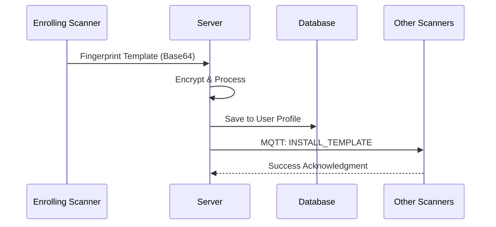
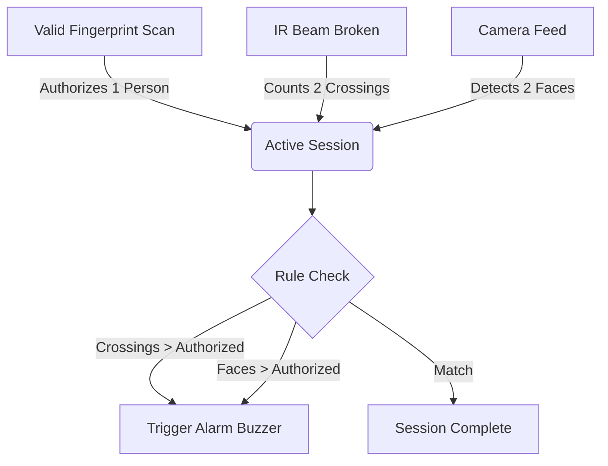
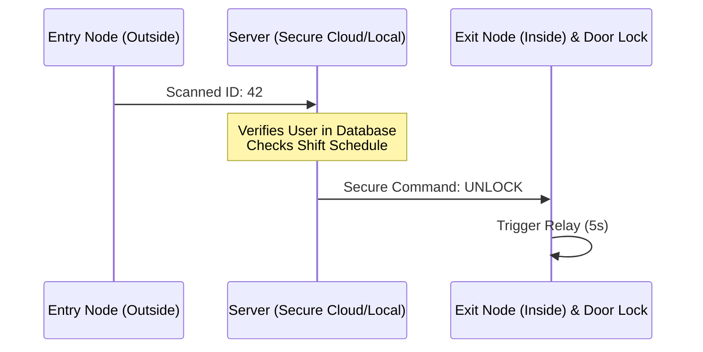
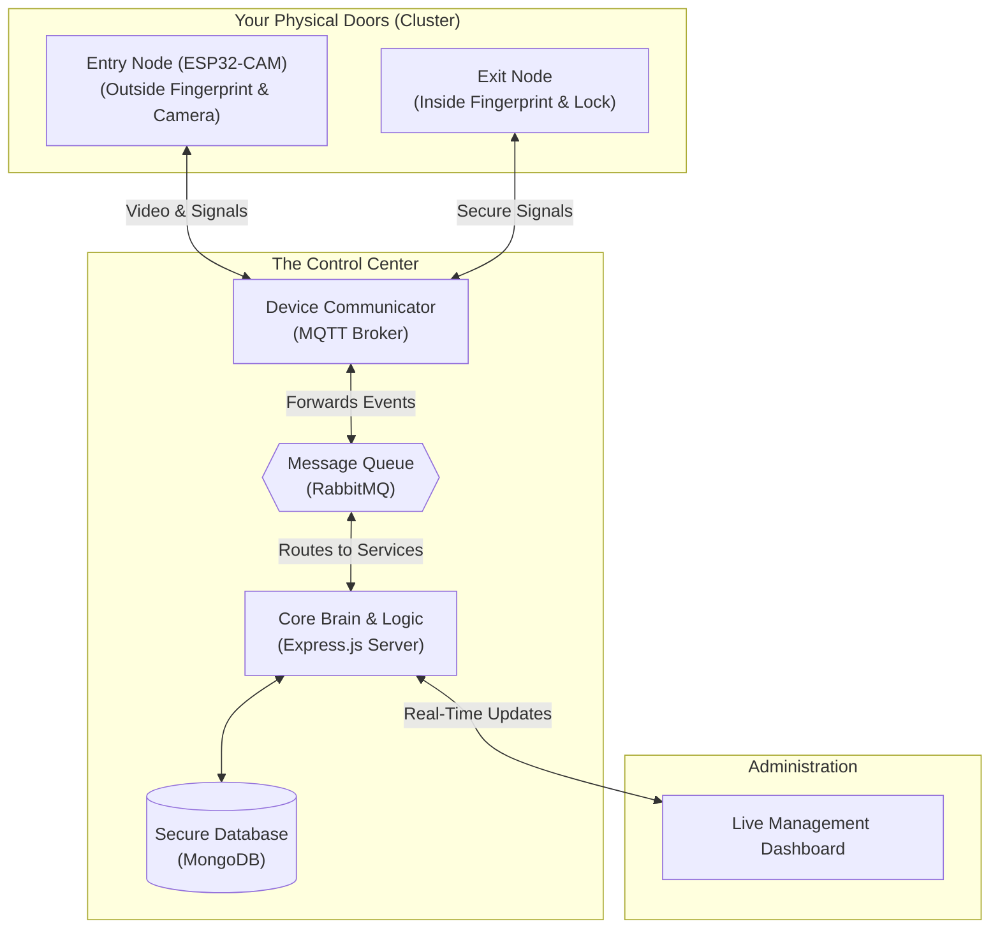

# IoT Biometric Attendance System - Client Overview

## 1. Executive Summary
Welcome to the IoT Biometric Attendance System. This system is designed to provide secure, automated, and highly reliable access control and attendance tracking for your facility. 

By combining physical hardware (fingerprint scanners and smart doors) with a powerful cloud-based server, the system ensures that only authorized personnel can access restricted areas, while simultaneously logging their attendance in real-time. The system is designed to be **highly secure**, **resilient to network outages**, and **easy to manage** through a centralized web dashboard.

---

## 2. Core Features & Benefits

### 🌍 "Enroll Once, Access Everywhere" (Global Sync)
Traditionally, fingerprint systems require users to register their fingerprint at every single door. 
**Our Solution:** When a new employee is enrolled on *any* scanner in your facility, the server securely encrypts their fingerprint template and automatically synchronizes it to *all* other doors. 
**Benefit:** Zero repetitive enrollments. Instant access across the entire campus.

**How it Works (Technical Flow):**
When a user finishes enrolling, the ESP32 scanner converts the physical fingerprint into a mathematical template (a binary string). It sends this template to the Server via MQTT. The Server stores it in the central MongoDB database and instantly broadcasts an `INSTALL_TEMPLATE` command to all other active scanners on the network, writing the template directly into their local memory slots.

### 🛡️ Smart Anti-Tailgating Detection
A common security flaw in standard systems is "tailgating"—where one person scans their fingerprint, but two people walk through the open door.
**Our Solution:** Our entry doors are equipped with a camera and invisible infrared (IR) beam sensors. When the door opens, the system constantly monitors the doorway.
**Benefit:** Prevents unauthorized physical access and maintains strict security compliance.

**How it Works (Technical Flow):**
The server correlates three distinct sensor feeds within a localized 10-second session window:
1. **Fingerprint Scanner (Authorization)**: A valid scan sets the `Authorized Count` to 1.
2. **Camera (Visual Analysis)**: The ESP32-CAM streams frames to the server, which counts the number of detected faces. 
3. **IR Beam Sensor (Physical Crossing)**: Tracks the concrete number of individuals breaking the invisible beam.
If the `IR Crossings > Authorized Count` AND the camera confirms multiple faces, the server emits a `TAILGATING` alert, immediately firing the buzzers on both the Entry and Exit nodes.

### 🔒 Server-Controlled Security (Zero-Trust Hardware)
If a physical scanner outside a door is tampered with or broken into, the door remains locked. 
**Our Solution:** The hardware outside the door *cannot* open the door itself. It only reads the fingerprint and asks the secure server inside your network for permission. The server validates the user's shift, checks for tailgating, and only then sends an encrypted signal to the *inside* hardware to unlock the door.

**How it Works (Technical Flow):**
The Entry Node (outside the door) has absolutely no physical wiring to the magnetic door lock. When a finger is scanned, it only sends a numeric ID to the server. The Server's logic engine (`RecognitionService`) validates the user's shift rules and current status in the database. Only if approved does the server send a targeted `UNLOCK_DOOR` command specifically to the MAC address of the paired Exit Node (inside the building), which then pulses the GPIO pin connected to the lock relay.

---

## 3. The User Journey: How It Works

### Scenario A: Enrolling a New Employee
1. The Administrator logs into the secure web dashboard.
2. They select an employee and choose an available scanner from a dropdown list (e.g., "Front Desk Scanner").
3. The server tells that specific scanner to activate its enrollment mode.
4. The employee places their finger on the sensor. The dashboard updates live ("Place finger... Remove finger...").
5. The template is captured, saved to the database, and synced globally to all doors.

### Scenario B: Daily Check-In
1. An employee places their finger on the Entry Scanner outside the building.
2. The scanner recognizes the fingerprint and securely notifies the server.
3. The server checks the employee's schedule. If valid, it records their attendance (noting if they are on-time or late).
4. Simultaneously, the server commands the internal Exit hardware to unlock the door for 5 seconds.
5. The employee walks through, breaking the IR beam, which confirms a successful entry.

---

## 4. System Architecture (High-Level)

The system is built on a robust, event-driven architecture, ensuring speed and reliability even with multiple hardware nodes communicating simultaneously.

### How the Nodes Connect & The Role of RabbitMQ
To guarantee that no fingerprint scans or security alerts are ever lost, the system uses a highly resilient messaging pipeline:
1. **The Two Hardware Nodes:** Each door setup uses two distinct ESP32 microchips: an Entry Node (ESP32-CAM, which handles both outside fingerprint scans and camera face-counting) and an Exit Node (which handles inside scans and securely controls the lock relay). Both connect securely to your Wi-Fi network.
2. **The MQTT Broker:** The two nodes do not talk directly to the database. Instead, they publish lightning-fast messages (like "Fingerprint 42 Scanned" or "IR Beam Broken") to the MQTT Broker.
3. **RabbitMQ (The Traffic Cop):** The MQTT Broker immediately forwards these messages into **RabbitMQ**, an enterprise-grade message queue. RabbitMQ securely holds onto these events and routes them to the correct logic services on the server. If the main server is temporarily busy or restarting, RabbitMQ ensures the messages wait safely in line without being dropped.
4. **The Express Server (The Brain):** The server processes the queued events from RabbitMQ, saves them to the MongoDB database, and pushes the live results out to your React Dashboard. When the server decides to unlock the door, it sends the command back through RabbitMQ -> MQTT -> Exit Node.

### Why a "Cluster"?
Every physical door is logically grouped in the software as a **Cluster** containing these two devices working together:
* **The Entry Device:** An ESP32-CAM that handles inbound fingerprint scans, streams live video, and counts faces for tailgating detection.
* **The Exit Device:** Handles outbound scans and physically controls the electronic door lock.

---

## 5. Technical Specifications & Developer Details

*(This section is intended for IT personnel, system administrators, and developers.)*

### Hardware Wiring Guide
**ENTRY Node (ESP32-CAM)**
- Fingerprint Scanner: RX = GPIO 14, TX = GPIO 15
- IR Beam Sensor: GPIO 13
- Alarm Buzzer: GPIO 12

**EXIT Node (ESP32 Standard)**
- Fingerprint Scanner: RX = GPIO 16, TX = GPIO 17
- Electronic Door Relay: GPIO 13 (HIGH = Unlock)
- IR Beam Sensor: GPIO 15
- Status LED (RGB): Red = 26, Green = 27, Blue = 14

### Device Registration & Network Security
New hardware cannot join the network automatically.
1. When a new device is wired and powered on, it broadcasts a `DEVICE_REGISTER` event containing its unique hardware MAC address.
2. It remains in a `PENDING` state on the server.
3. An IT Administrator must manually review the device in the dashboard, assign it to a physical door Cluster, and click **Approve**.
4. Only then will the server accept biometric data or unlock commands for that device.

### MQTT Topics & Message Queues
To keep the data pipelines incredibly fast and organized, the system uses strictly defined communication channels:
- **MQTT Topic: `biometric/events`**: Both physical hardware nodes continuously publish their data here (e.g., Heartbeats, Fingerprint IDs, IR Beam breaks, Camera captures).
- **MQTT Topic: `biometric/commands`**: The physical nodes *subscribe* to this topic. The server publishes strictly secured commands here (e.g., `UNLOCK_DOOR`, `ENROLL`, `TEMPLATE_SYNC`).
- **RabbitMQ Queue: `biometric.events.queue`**: The server's MQTT Bridge picks up hardware messages from MQTT and securely drops them into this RabbitMQ queue. This ensures that if 100 people scan their fingers at the exact same second across the campus, the database isn't overwhelmed—they line up safely in this queue.
- **RabbitMQ Queue: `biometric.commands.queue`**: When the server decides a door should open, it places the command here. The MQTT Bridge pulls it and pushes it out to the Exit Node.

### Server ↔ Dashboard Communication
Once the Server (Express.js) processes the raw hardware events, it needs a way to communicate these updates to the administration interface (React Dashboard). It uses two separate channels:

1. **RESTful HTTP API (For Data Fetching & Commands)**
   Standard API endpoints are used when the dashboard needs to pull historical data or send one-off commands.
   - `GET /api/users` - Fetches the list of enrolled employees.
   - `GET /api/devices/clusters` - Fetches the current door configurations.
   - `POST /api/sync/enroll` - Admin clicks "Start Enrollment" on the dashboard, which triggers the server to send the `ENROLL` MQTT command to the hardware.

2. **Socket.io WebSockets (For Real-Time Live Updates)**
   Because attendance happens fast, the dashboard cannot constantly "ask" the server for updates. Instead, the server pushes live updates to the dashboard the millisecond they happen.
   - **`attendance_update`**: Pushed to the dashboard when a user successfully scans in, allowing the UI to show a live feed of who just walked through the door.
   - **`enrollment_progress`**: Pushes the step-by-step progress (e.g., "Place Finger", "Remove Finger", "Success") from the hardware -> MQTT -> Server -> WebSocket -> Dashboard, providing a seamless user experience.
   - **`device_health`**: Pushes online/offline status changes if a node stops sending heartbeats.

### Resilience & Auto-Recovery
- Devices send `HEARTBEAT` pulses every 30 seconds. If the server receives no heartbeat for 2 minutes, the device is flagged as `OFFLINE` on the dashboard.
- The software infrastructure utilizes exponential backoff to automatically reconnect to databases and message brokers after a power or network outage.
